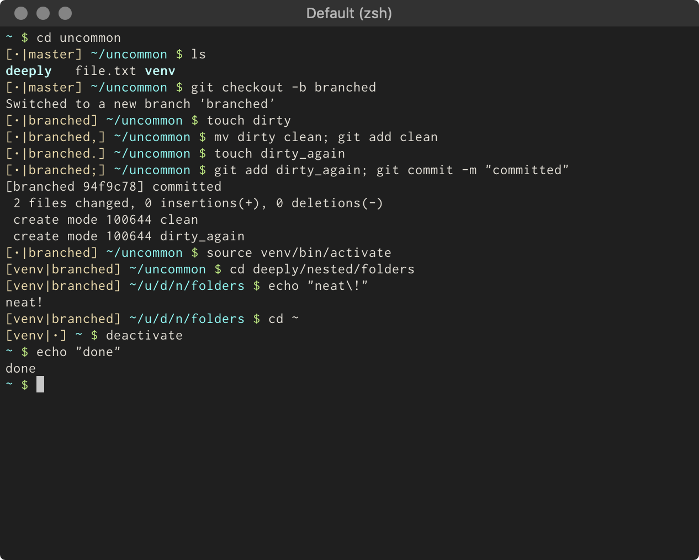

# <em>un</em>common


A fork of the zsh [common](https://github.com/jackharrisonsherlock/common) theme by [Jack Harrison-Sherlock](https://github.com/jackharrisonsherlock).

## Installation

### [Antigen](https://github.com/zsh-users/antigen)

Update your `.zshrc` file with:

```sh
antigen bundle daturkel/uncommon
```

### [Antibody](https://github.com/getantibody/antibody)

Update your `.zshrc` file with:

```sh
antibody bundle daturkel/uncommon
```

### [Oh My Zsh](http://ohmyz.sh)

```sh
wget -O $ZSH_CUSTOM/themes/uncommon.zsh-theme https://raw.githubusercontent.com/daturkel/uncommon/master/uncommon.zsh-theme
```

Update your `.zshrc` file with:
```sh
ZSH_THEME="uncommon"
```
